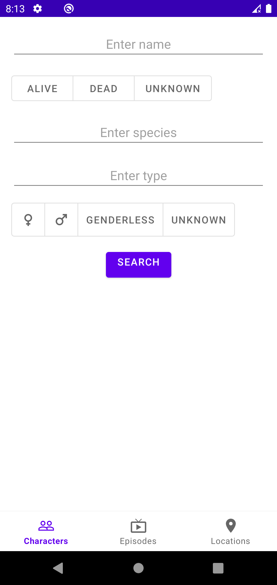

# Rick and Morty

Application written in Kotlin, Java that displays characters, episodes and locations of Rick and
Morty series, allows you to filter the received data, and shows the details of each chosen
character, episode or location.

## Table of contents

* [General info](#general-info)
* [Screenshots](#screenshots)
* [Technologies](#technologies)
* [API](#API)

#### General info:

App starts with the Splash Screen (screenshot 1) created with the SplashScreen API that lets apps
launch with any icon or your app icon, and a transition to the app itself.

App contains a bottom navigation with 3 tabs: Characters, Episodes, Locations. (screenshot 2-4) All
tabs support Pull-to-Refresh. The pages of data displayed using Paging library, PagingDataAdapter
and RecyclerView adapter that handles paginated data. The Glide library was used to work with
pictures.

There is a text field with the search by character's name and floating button that leads to filter
fragment (screenshot 5 for character filter). Screens with filters are different for different types
of content. They contain options for filtering, as well as a button for applying the filter.

Clicking on an item from the list opens a screen with the selected item's details (screenshot 6-8).

For each list and detail fragment, its own ViewModel has been created that receives data and
processes changes. The project is written in Kotlin, except for the UI layer of Character Details
and Location Details. The Retrofit library used for network requests. Coroutines and RxJava for
working with threads. The application supports caching and has the ability to work without the
Internet. The filtering functionality also supports work without the Internet. Dagger 2 library is
used to manage dependencies of the app.

#### Screenshots:

	

#### Technologies:

* Kotlin
* Java
* Glide
* Coroutines
* RxJava
* Retrofit
* Pagging 3
* Room
* Dagger2
* MVVM, Clean architecture

#### API:

All of the data and images presented in this app are sourced
from [The Rick and Morty API](https://rickandmortyapi.com/).